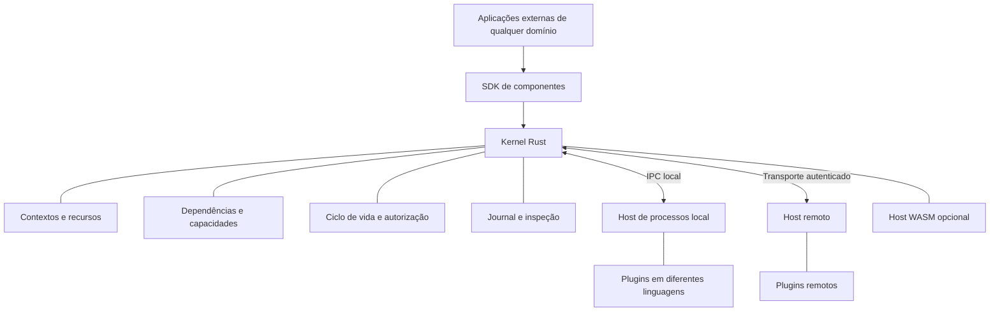

# Arquitetura proposta

Status: projeto v0.1. Para comportamento implementado, consultar [STATUS](STATUS.md).

## Componentes

O kernel é uma biblioteca de semântica e um serviço que a expõe. Uma única autoridade decide a composição no v0.1. Hosts executam instruções sobre os recursos que controlam. SDKs traduzem o contrato para cada linguagem. Código de negócio fica em plugins.

## Modelo de concorrência

Proposta inicial: um coordenador serializa mutações de metadados por domínio de composição; workers executam chamadas e I/O fora desse coordenador. Cada admissão gera um ticket com contexto, geração, capacidades concedidas e orçamento. Conclusões retornam ao coordenador e são validadas novamente.

Nunca executar código de plugin, esperar rede ou realizar cleanup bloqueante mantendo o lock de metadados. Descarte primeiro bloqueia admissão, depois agenda cancelamento/limpeza, depois confirma conclusão. Filas são limitadas.

O coordenador é uma escolha inicial para reduzir interleavings do plano de controle; não implica serializar trabalho de ferramentas. Só particionar a autoridade após medir contenção e definir invariantes entre partições.

## Propriedade e dependências são estruturas diferentes

A árvore de contextos define quem deve ser descartado com quem. O grafo de dependências define quem pode estar ativo. Um consumidor não precisa ser filho do provedor. Supervisão usa política explícita sobre instâncias e não deve confundir as duas estruturas.

## Localidade

- In-process: implementação confiável, recompilada junto; não há sandbox ou preempção garantida.
- Processo local: protocolo sobre socket Unix; host aplica limites e administra descendentes.
- WASM: host opcional com interfaces e recursos mediados; detalhes do Component Model entram após conformidade local.
- Remoto: mesmo modelo de mensagens e identidade, com falhas e garantias próprias descritas em [REMOTE](REMOTE.md).

IPC reduz overhead em relação a deslocar trabalho pela rede; não elimina cópias ou escalonamento. Não iniciar com memória compartilhada. Transfers de dados grandes podem ganhar um caminho específico depois de benchmarks, preservando autorização e propriedade.

## Limites do núcleo

O kernel conhece interfaces e lifecycle, não prompts ou estratégias de agente. O journal não transforma comandos arbitrários em transações. Isolamento não prova reversibilidade. Componentes antigos só continuam operando dentro de uma política explícita de drenagem e sempre sob validação de autoridade.

O plano de dados pode futuramente ter canais diretos entre hosts; v0.1 passa pelo kernel para tornar autorização e inspeção verificáveis. Federação entre kernels não está no primeiro escopo.
